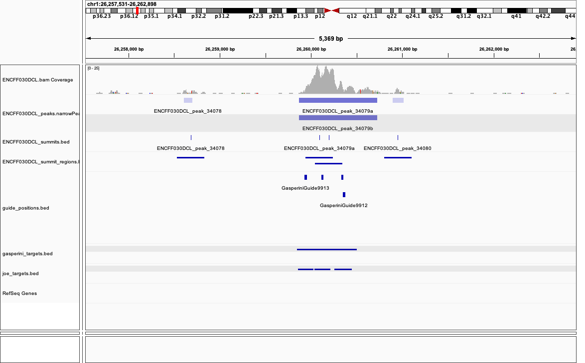

```{r setup, include=FALSE}
knitr::opts_chunk$set(echo = FALSE)
```

## Goal
Gasperini et al., 2019 gRNA sequences were re-mapped using BLAT. Here these are overlapped with K562
DNase-seq peak summits to assign them to putative enhancers.

```{r requiredPackages, warning=FALSE, message=FALSE}
library(tidyverse)
library(here)
library(cowplot)
library(GenomicRanges)
library(rtracklayer)
```

***

## Used data
Re-mapped gRNA coordinates are taken from Joe's analysis. K562 hg19 DNase-seq summits and peaks were
called from the ENCODE DNase-seq bam file ENCFF030DCL using MACS2.

```{r loadData}
# bed file containing re-mapped gRNAs from Joe in a bed-like format
guides_file <- here("resources/Gasperini2019/guide_positions.bed")

# column types in grnas_file
guides_cols <- cols(
  chr = col_character(),
  start = col_integer(),
  end = col_integer(),
  name = col_character(),
  score = col_double(),
  strand = col_character(),
  spacer = col_character()
)

# load re-mapped gRNAs
guides <- read_tsv(guides_file, col_types = guides_cols, col_names = names(guides_cols$cols))

# file containing DNase-seq peaks
dnase_peaks_file <- here("resources/DNase/ENCFF030DCL/ENCFF030DCL_peaks.narrowPeak")

# column types in dnase_peaks_file
dnase_peaks_cols <- cols(
  chr = col_character(),
  start = col_integer(),
  end = col_integer(),
  name = col_character(),
  score = col_double(),
  strand = col_character(),
  signalValue = col_double(),
  pValue = col_double(),
  qValue = col_double(),
  peak = col_double()
)

# load DNase-seq peaks
dnase_peaks <- read_tsv(dnase_peaks_file, col_types = dnase_peaks_cols,
                        col_names = names(dnase_peaks_cols$cols))

# remove peaks on chrY and chrM
dnase_peaks <- filter(dnase_peaks, !chr %in% c("chrY", "chrM"))

# load DNase-seq summits from bed file
dnase_summits_file <- here("resources/DNase/ENCFF030DCL/ENCFF030DCL_summits.bed")
dnase_summits <- import(dnase_summits_file, format = "bed")

# remove summits on chrY and chrM
dnase_summits <- dnase_summits[!seqnames(dnase_summits) %in% c("chrY", "chrM")]

# load gasperini et al targets
gasp_targets_file <- here("resources/Gasperini2019/gasperini_targets/gasperini_targets.bed")
gasp_targets <- import(gasp_targets_file, format = "bed")
```

***

## DNase-seq summit regions
DNase-seq summits are extended by 150 bp on each side to create summit regions. However, this
extension leads to overlaps between regions and can create very large "super regions". 

```{r, fig.width=10, fig.height=3}
# create DNase-seq summit regions by extending summit by +/- 150bp
dnase_summits <- resize(dnase_summits, width = 300, fix = "center")

# count number of overlaps per dnase summit region
dnase_summit_overlaps <- countOverlaps(dnase_summits, dnase_summits) %>% 
  tibble(summit = dnase_summits$name, overlaps = .) %>% 
  mutate(overlaps = overlaps -1 )  # subtract overlaps with itself

# plot the number of overlaps of every DNase-seq summit region with other regions
p1 <- ggplot(dnase_summit_overlaps, aes(overlaps)) +
  geom_histogram(binwidth = 1) +
  labs(title = paste("Overlaps summit regions"), x = "Overlaps") +
  theme_bw()
  
# merge overlapping DNase regions to create super regions
dnase_super_regions <- reduce(dnase_summits, with.revmap = TRUE)

# create data frame with number of merged summits and size per super region
dnase_super_regions_stats <- tibble(
  region = paste0(seqnames(dnase_super_regions), ":", start(dnase_super_regions), "-",
                  end(dnase_super_regions)),
  summits = vapply(dnase_super_regions$revmap, FUN = length, FUN.VALUE = integer(1)),
  size = width(dnase_super_regions) )

# plot the number of summits per super region
p2 <- ggplot(dnase_super_regions_stats, aes(summits)) +
  geom_histogram(binwidth = 1) +
  labs(title = "Summits per super region", x = "Summits") +
  theme_bw()

# plot size distribution of overlapping super regions
p3 <- ggplot(dnase_super_regions_stats, aes(size)) +
  geom_histogram(binwidth = 50) +
  labs(title = "Super region sizes", x = "Size (bp)") +
  theme_bw()

# create multi-panel plot
plot_grid(p1, p2, p3, nrow = 1)
```

***

## DNase-seq peaks
MACS2 DNase-seq peaks can also be used as candidate regions. These do not contain any overlapping
regions. The peak calls however contain "duplicates" for cases where one peak has multiple summits (
one entry per summit).

```{r, fig.height=3, fig.width=4}
# create GRanges object with unique DNase-seq peaks
dnase_peaks_gr <- unique(makeGRangesFromDataFrame(dnase_peaks, starts.in.df.are.0based = TRUE))

# create new peak names based on coordinates
dnase_peaks_gr$name <- paste0(as.character(seqnames(dnase_peaks_gr)), ":", start(dnase_peaks_gr),
                              "-", end(dnase_peaks_gr))

# plot DNase-seq peak sizes
dnase_peaks_gr %>% 
  width() %>% 
  as_tibble() %>% 
  ggplot(., aes(value)) +
    geom_histogram(binwidth = 50) +
    labs(title = "DNAse-seq peak sizes", x = "Size (bp)") +
    theme_bw()
```

***

## Overlapping Gasperini guides with DNase-seq summit regions and peaks
Re-mapped Gasperini et al. guides are overlapped with DNase-seq summit regions and peaks to assess
how these perform to assign guides to perturbed cCREs.

```{r}
# create GRanges object from guide coordinates
guides_gr <- makeGRangesFromDataFrame(guides, keep.extra.columns = TRUE,
                                      starts.in.df.are.0based = TRUE)

# count the number of overlaps with DNase-seq summits and peaks per guide
n_ovl_summits <- countOverlaps(query = guides_gr, subject = dnase_summits, ignore.strand = TRUE)
n_ovl_peaks <- countOverlaps(query = guides_gr, subject = dnase_peaks_gr, ignore.strand = TRUE)

# create tibble containing overlaps
n_ovl <- tibble(guide = guides_gr$name, summits = n_ovl_summits, peaks = n_ovl_peaks) %>% 
  pivot_longer(cols = -guide, names_to = "type", values_to = "overlaps") %>% 
  mutate(type = fct_relevel(type, "summits"))

# plot the number of overlaps
p1 <- ggplot(n_ovl, aes(overlaps)) +
  facet_wrap(~type, ncol = 1) +
  geom_histogram(binwidth = 1) +
  labs(title = "Number of targets per guide") +
  theme_bw()

# compute percentage of guides overlapping at least one target
perc_ovl <- n_ovl %>%
  group_by(type) %>%
  summarize(perc_ovl = mean(overlaps > 0))
```

```{r}
# find overlapping guide and summit/peak pairs
ovl_summits <- findOverlapPairs(query = guides_gr, subject = dnase_summits, ignore.strand = TRUE)
ovl_peaks <- findOverlapPairs(query = guides_gr, subject = dnase_peaks_gr, ignore.strand = TRUE)

# for every summit or peak that overlaps a guide, count the number of guides targeting it
guides_per_summit <- table(second(ovl_summits)$name)
guides_per_peak <- table(second(ovl_peaks)$name)

# create one tibble containing guides per summit region and peak
guides_per_summit <- tibble(target = names(guides_per_summit), guides = as.integer(guides_per_summit))
guides_per_peak <- tibble(target = names(guides_per_peak), guides = as.integer(guides_per_peak))
guides_per_target <- bind_rows(summits = guides_per_summit, peaks = guides_per_peak, .id = "type") %>% 
  mutate(type = fct_relevel(type, "summits"))

# plot the number of guides per summit region or peak
p2 <- ggplot(guides_per_target, aes(guides)) +
  facet_wrap(~type, ncol = 1) +
  geom_histogram(binwidth = 1) +
  labs(title = "Number of guides per target") +
  theme_bw()
```

```{r}
plot_grid(p1, p2, nrow = 1)
```

`r round(filter(perc_ovl, type == "summits")[, 2] * 100, digits = 1)`% of Gasperini guides overlap a
DNase-seq summit region and `r round(filter(perc_ovl, type == "peaks")[, 2] * 100, digits = 1)`%
overlap a DNase-seq peak.

***

## Gasperini targets
Targets as defined by Gasperini et al are overlapped with DNase-seq summits, summit regions and
peaks.

```{r, fig.height=3, fig.width=4.5}
# extract enhancers from gasperini targets
gasp_enh <- gasp_targets[grepl(gasp_targets$name, pattern = "^chr.+")]

# plot gasperini target sizes
gasp_enh %>% 
  width() %>% 
  tibble(size = .) %>% 
  ggplot(., aes(size)) +
    geom_histogram(binwidth = 50) +
    labs(title = "Gasperini enhancer sizes", x = "size (bp)") +
    theme_bw()
```

```{r, fig.height=3, fig.width=8}
# recreate 1bp summits from summit regions
dnase_summits_1bp <- resize(dnase_summits, width = 1, fix = "center")

# count overlaps between gasperini enhancers and DNase-seq summits, summit regions and peaks
gasp_enh_summits <- countOverlaps(query = gasp_enh, subject = dnase_summits_1bp)
gasp_enh_summit_regions <- countOverlaps(query = gasp_enh, subject = dnase_summits)
gasp_enh_peaks <- countOverlaps(query = gasp_enh, subject = dnase_peaks_gr)

# create tibble containing overlaps
gasp_ovl <- tibble(gasp_enh = gasp_enh$name, summits = gasp_enh_summits,
                   summit_regions = gasp_enh_summit_regions, peaks = gasp_enh_peaks) %>% 
  pivot_longer(cols = -gasp_enh, names_to = "type", values_to = "overlaps") %>% 
  mutate(type = fct_relevel(type, "summits", "summit_regions"))

# plot number of overlaps per gasperini enhancer
ggplot(gasp_ovl, aes(overlaps)) +
  facet_wrap(~type, nrow = 1) +
  geom_histogram(binwidth = 1) +
  labs(title = "Overlaps between Gasperini enhancers and summits, summit regions and peaks") +
  scale_x_continuous(breaks = seq(0, max(gasp_ovl$overlaps), by = 1)) +
  theme_bw()
```

***

## Choosing perturbation targets
Overlapping summit regions can create complex loci, where guides overlap multiple overlapping summit
regions:



A suitable target selection strategy needs to be chosen for cases like this. In this example, it's
likely that all 4 guides target the same element, i.e. the summit regions can be merged.

```{r, fig.height=4, fig.width=10}
# get DNase-seq summit regions overlapping guides
dnase_summits_guides <- subsetByOverlaps(dnase_summits, ranges = guides_gr, ignore.strand = TRUE)

# merge overlapping regions into new targets
targets <- reduce(dnase_summits_guides, ignore.strand = TRUE, with.revmap = TRUE)

# create new target id based on coordinates
targets$name <- with(targets, paste0(seqnames, ":", start, "-", end))

# get size and number of regions that were merged for every target
target_size <- width(targets)
merged_regions <- vapply(targets$revmap, FUN = length, FUN.VALUE = integer(1))
target_stats <- tibble(target = targets$name, size = target_size, merged_regions)

# plot size and the number of merged regions per target
p1 <- ggplot(target_stats, aes(x = size)) +
  geom_histogram(binwidth = 50) +
  labs(title = "Target element sizes", x = "size (bp)") +
  theme_bw()

p2 <- ggplot(target_stats, aes(x = merged_regions)) +
  geom_histogram(binwidth = 1) +
  labs(title = "Merged summit regions per target", x = "merged DNase summit regions") +
  theme_bw()

# arrange plots into one figure
plot_grid(p1, p2, nrow = 1)
```
